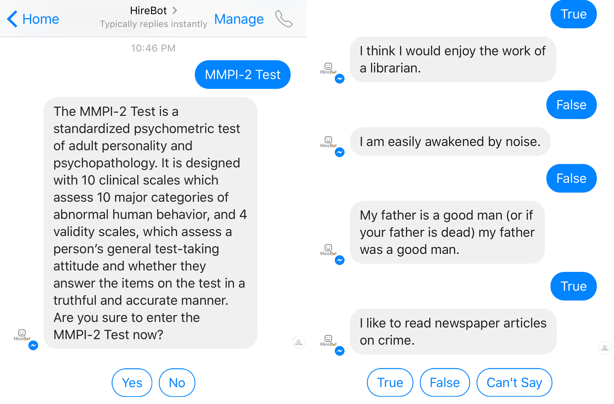
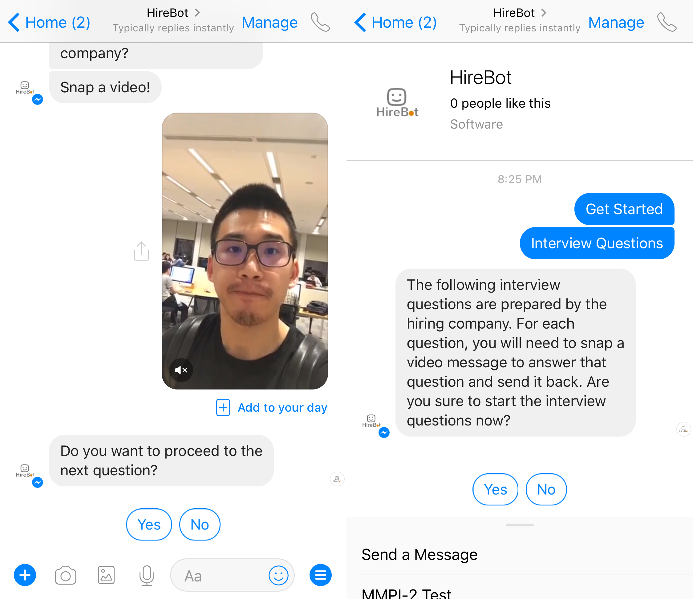

# HireBot

One of the main responsibilities of Human Resources is the task of screening candidates for a certain job. Nowadays, automated hiring systems have been widely used by the HR department. However, in most of the computerized hiring systems, the personality traits and the emotion process of job candidates as an important factor of consideration in recruitment are overlooked and rarely well analyzed. Therefore, I came up with the idea of building a conversational chatbot called HireBot by utilizing the technology of facial image processing and emotion detection. The goal of the chatbot is to output a well- rounded evaluation of job candidates' personality traits and emotion process.

## 1. Software Design

HireBot is built with 4 main components: Facebook Messenger, Heroku, Affectiva and EmoVu. Facebook Messenger is a chatting platform where HireBot resides on. Heroku is a cloud platform where the chatbot application is deployed. Affectiva is a emotion technology company that provides open API to track the emotion states of a candidate when answering interview questions. EmoVu is a deep learning-based emotion recognition software that reads facial micro-expressions in real-time.
 

## 2. MMPI-2 Test

The chatbot implements the MMPI-2 test in a conversational form. Users can initiate a test simply by pressing the menu item down the screen. For each question, users only need to press a button among True/False/Can't Say to send a quick reply. The responses will be recorded for each user in the backend. After the user finishes all the questions, the chatbot is going to send back the test results in the form of text messages. The user can cancel the test at any time by sending a text message "End". In the future work, a pause/resume function is planned to be implemented to provide more comfortable test-taking experience.
 

## 3. Interview Questions

The hiring company usually provides a list of interview questions. Users need to send back a video message to answer each interview question. After the user sends the video message, the chatbot is going to process the video message and output the emotion analysis results, which is an emotion radar chart and an emotion tracking diagram. The following subsection is going to explain these two results.
 

